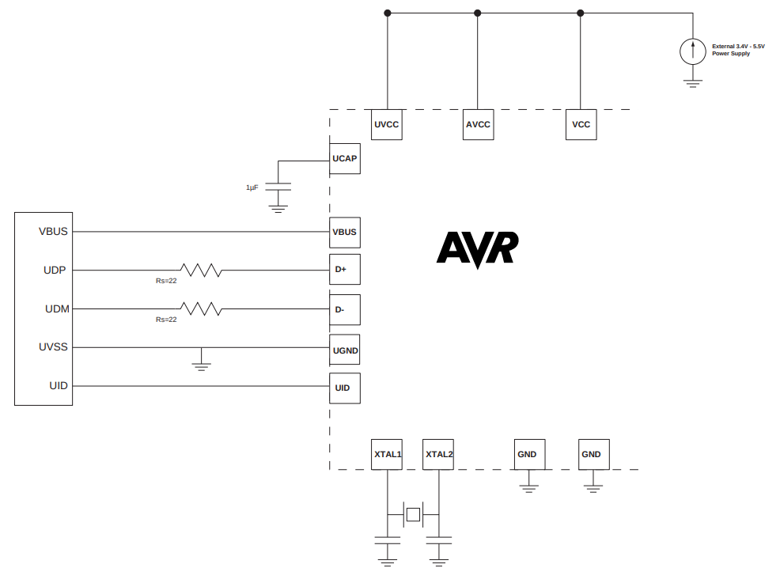

# ATmega32U4設計メモ

## 電源回路

<figure>
<figcaption><a href="https://ww1.microchip.com/downloads/en/DeviceDoc/Atmel-7766-8-bit-AVR-ATmega16U4-32U4_Datasheet.pdf">Atmel-7766J-USB-ATmega16U4/32U4-Datasheet_04/2016</a> P.258「21.3.2 Self Powered Device」Figure 21-5. Typical Self Powered Application with 3.4V to 5.5V I/O</figcaption>

</figure>

## セラロック選定

ATmega32U4を搭載した小型のArduino互換基板に搭載されているセラロックのベース品番は、村田製作所の「CSTNE16M0V\*」のようだ（[参考](https://electronics.stackexchange.com/a/665240)）。適合するセラロックは「[SimSurfing: IC-タイミングデバイス検索ツール](https://ds.murata.co.jp/simsurfing/ic-timing-device.html)」で検索できる。ATmega32U4そのものは登録されていないので、ATmega32M1、ATmega32C1で検索した。

2025-05-09T04:07:26.697Z

<figure>
<figcaption><a href="https://ds.murata.co.jp/simsurfing/ic-timing-device.html?lcid=ja&icmaker=Microchip&icname=ATmega32M1&tdhin=CSTNE16M0V&spec_application=0&supplystatus=0&kosa=0&tempL=0&tempH=0">ATmega32M1</a></figcaption>

|IC品名|IC備考|ICメーカー|品番|適用用途[^1]|ステータス[^2]|発振周波数\[MHz]|周波数許容偏差|CL1\[pF][^3]|CL2\[pF][^4]|Rf\[ohm]|Rd\[ohm]|IC電圧(min.)\[V]|IC電圧(max.)\[V]|使用温度(min.)\[deg.C]|使用温度(max.)\[deg.C]|IC Application|
|---|---|---|---|:---:|:---:|---|---|---|---|---|---|---|---|---|---|---|
|ATmega32M1|CKSEL:111|Microchip|CSTNE16M0V53C000R0|`APS`|`生産中`|16|+/-0.5%|15|15|Open|0|4.5|5.5|-40|125||
|ATmega32M1|CKSEL:111|Microchip|CSTNE16M0VH3C000R0|`APS`|`生産中`|16|+/-0.07%|15|15|Open|0|4.5|5.5|-40|125||

</figure>

[^1]: <dl><dt><code>CE</code></dt><dd>民生機器</dd><dt><code>IE</code></dt><dd>産業機器</dd><dt><code>AIC</code></dt><dd>自動車用インフォテインメント / コンフォート機器</dd><dt><code>APS</code></dt><dd>自動車用パワートレイン / セーフティ機器</dd><dt><code>MAB</code></dt><dd>医療機器 [GHTF A/B]</dd><dt><code>MC</code></dt><dd>医療機器 [GHTF C]</dd><dt><code>MD</code></dt><dd>医療機器 [GHTF D]</dd><dt><code>MeI</code></dt><dd>インプラント除く医療機器 [GHTF A/B/C]</dd><dt><code>MI</code></dt><dd>インプラント医療機器または医療機器 [GHTF D]</dd><dt><code>MeS</code></dt><dd>インプラント・手術・自動投与用途除く医療機器 [GHTF A/B/C]</dd><dt><code>ME</code></dt><dd>モバイル機器</dd><dt><code>MC</code></dt><dd>モバイル通信</dd><dt><code>IeT</code></dt><dd>運輸・設備・商用エネルギー関連を除く産業機器</dd><dt><code>CDT</code></dt><dd>民生機器-差動伝送</dd><dt><code>HDD</code></dt><dd>HDD</dd><dt><code>DFD</code></dt><dd>重送検知</dd><dt><code>AaM</code></dt><dd>自動車用機器 <a href="https://www.murata.com/contactform?Product=Capacitor">[ムラタへ問合せ要]</a></dd><dt><code>MaM</code></dt><dd>医療機器 <a href="https://www.murata.com/contactform?Product=Capacitor">[ムラタへ問合せ要]</a></dd></dl>
[^2]: <figure><figcaption>「製品ステータス」の説明</figcaption><dl><dt><code>開発中</code></dt><dd>開発中の製品です。サンプル対応可否、量産時期についてはお問い合わせください。</dd><dt><code>生産中</code></dt><dd>量産、販売中の製品です。</dd><dt><code>NRND</code></dt><dd>新モデルへの部品採用を控えていただきたい製品です。 (Not Recommended for New Design)</dd><dt><code>生産中止予定</code></dt><dd>生産中止予定の製品であり、最終受注期限及び最終生産時期が表示されている場合があります。 最終受注期限までに、必要数量の連絡をお願いします。</dd><dt><code>生産中止</code></dt><dd>生産を中止しており、ご注文を受け付けていない製品です。</dd></dl></figure>
[^3]: 水晶振動子：外付け容量 セラロック：内蔵容量
[^4]: 水晶振動子：外付け容量 セラロック：内蔵容量

<figure>
<figcaption><a href="https://ds.murata.co.jp/simsurfing/ic-timing-device.html?lcid=ja&icmaker=Microchip&icname=ATmega32C1&tdhin=CSTNE16M0V&spec_application=0&supplystatus=0&kosa=0&tempL=0&tempH=0">ATmega32C1</a></figcaption>

|IC品名|IC備考|ICメーカー|品番|適用用途[^1]|ステータス[^2]|発振周波数\[MHz]|周波数許容偏差|CL1\[pF][^3]|CL2\[pF][^4]|Rf\[ohm]|Rd\[ohm]|IC電圧(min.)\[V]|IC電圧(max.)\[V]|使用温度(min.)\[deg.C]|使用温度(max.)\[deg.C]|IC Application|
|---|---|---|---|:---:|:---:|---|---|---|---|---|---|---|---|---|---|---|
|ATmega32C1|CKSEL:111|Microchip|CSTNE16M0V53C000R0|`APS`|`生産中`|16|+/-0.5%|15|15|Open|0|4.5|5.5|-40|125||
|ATmega32C1|CKSEL:111|Microchip|CSTNE16M0VH3C000R0|`APS`|`生産中`|16|+/-0.07%|15|15|Open|0|4.5|5.5|-40|125||

</figure>

[CSTNE16M0V53C000R0](https://www.digikey.jp/ja/products/detail/murata-electronics/CSTNE16M0V53C000R0/8747730)と[CSTNE16M0VH3C000R0](https://www.digikey.jp/ja/products/detail/murata-electronics/CSTNE16M0VH3C000R0/8747732)の違いは周波数許容偏差で、後者のほうが高精度になっている。前者のほうが安価なので、こちらを使用する。

- [CSTNE16M0V53C000R0|セラミック発振子/水晶振動子|タイミングデバイス|村田製作所](https://www.murata.com/ja-jp/products/productdetail?partno=CSTNE16M0V53C000R0)
- [CSTNE16M0V53C000R0 footprint & symbol by Murata | SnapMagic Search](https://www.snapeda.com/parts/CSTNE16M0V53C000R0/Murata/view-part/)

## その他

### DS4424（DS4424N+／DS4424N+T&R）

> T&R = Tape and reel.
> 
> [DS4422-DS4424.pdf](https://www.analog.com/media/en/technical-documentation/data-sheets/DS4422-DS4424.pdf), 19-4744; Rev 2; 9/17, p.1

- [DS4424 Datasheet and Product Info | Analog Devices](https://www.analog.com/en/products/ds4424.html)
- ★[DS4424N+ footprint, schematic symbol and 3D model by Analog Devices](https://componentsearchengine.com/part-view/DS4424N%2B/Analog%20Devices)（SamacSys）
- [DS4424N+T&R footprint, schematic symbol and 3D model by Analog Devices](https://componentsearchengine.com/part-view/DS4424N%2BT%26R/Analog%20Devices)（SamacSys）
- [Analog Devices / Maxim Integrated ds4424n+: Symbol, Footprint, 3D STEP Model | Ultra Librarian](https://app.ultralibrarian.com/details/bd464822-1067-11e9-ab3a-0a3560a4cccc/Analog-Devices-Maxim-Integrated/ds4424n-?uid=124205470)
- [Analog Devices / Maxim Integrated DS4424N+T&R: Symbol, Footprint, 3D STEP Model | Ultra Librarian](https://app.ultralibrarian.com/details/f838bba7-106d-11e9-ab3a-0a3560a4cccc/Analog-Devices-Maxim-Integrated/DS4424N-T-R?uid=124205471)
- [DS4424N+ footprint & symbol by Analog Devices | SnapMagic Search](https://www.snapeda.com/parts/DS4424N+/Analog%20Devices/view-part/)
- [DS4424N+T&R footprint & symbol by Analog Devices | SnapMagic Search](https://www.snapeda.com/parts/DS4424N%2BT%26R/Analog%20Devices/view-part/)

SamacSysには「This model has been built in collaboration with the manufacturer.」とある。品番がシンプルな方がファイルの取り回しにトラブルがないのでDS4424N+を使用。

### MCP659（MCP659-E/ML）

- [MCP659 | Microchip Technology](https://www.microchip.com/en-us/product/mcp659)
- [MCP659-E/ML footprint, schematic symbol and 3D model by Microchip](https://componentsearchengine.com/part-view/MCP659-E%2FML/Microchip)（SamacSys）
- [Microchip MCP659-E/ML: Symbol, Footprint, 3D STEP Model | Ultra Librarian](https://app.ultralibrarian.com/details/e2c9e99d-c6b2-11e9-ab3a-0a3560a4cccc/Microchip/MCP659-E-ML?uid=20012028)
- [MCP659-E/ML footprint & symbol by Microchip | SnapMagic Search](https://www.snapeda.com/parts/MCP659-E/ML/Microchip/view-part/)

### AD8403（AD8403ARU1／AD8403ARUZ1）

> Z = RoHS Compliant Part.
> 
> [AD8400_8402_8403.pdf](https://www.analog.com/media/en/technical-documentation/data-sheets/AD8400_8402_8403.pdf), Rev. E, p.31

- [AD8403 Datasheet and Product Info | Analog Devices](https://www.analog.com/en/products/ad8403.html)
- [AD8403ARUZ1-REEL footprint, schematic symbol and 3D model by Analog Devices](https://componentsearchengine.com/part-view/AD8403ARUZ1-REEL/Analog%20Devices)（SamacSys）
- [Analog Devices Inc AD8403ARUZ1: Symbol, Footprint, 3D STEP Model | Ultra Librarian](https://app.ultralibrarian.com/details/6c0e6e13-106d-11e9-ab3a-0a3560a4cccc/Analog-Devices-Inc/AD8403ARUZ1?uid=446994)
- [Analog Devices Inc AD8403ARUZ1-REEL: Symbol, Footprint, 3D STEP Model | Ultra Librarian](https://app.ultralibrarian.com/details/6c0e708d-106d-11e9-ab3a-0a3560a4cccc/Analog-Devices-Inc/AD8403ARUZ1-REEL?uid=446995)

### MAX14662（MAX14662ETI+／MAX14662ETI+T）

> T = Tape and reel
> 
> [MAX14662.pdf](https://www.analog.com/media/en/technical-documentation/data-sheets/MAX14662.pdf), 19-7308; Rev 1; 6/14, p.22

- [MAX14662 Datasheet and Product Info | Analog Devices](https://www.analog.com/en/products/max14662.html)
- [MAX14662ETI+ footprint, schematic symbol and 3D model by Analog Devices](https://componentsearchengine.com/part-view/MAX14662ETI%2B/Analog%20Devices)（SamacSys）
- [MAX14662ETI+T footprint, schematic symbol and 3D model by Analog Devices](https://componentsearchengine.com/part-view/MAX14662ETI%2BT/Analog%20Devices)（SamacSys）
- [Analog Devices / Maxim Integrated MAX14662ETI+: Symbol, Footprint, 3D STEP Model | Ultra Librarian](https://app.ultralibrarian.com/details/9a478c29-10a1-11e9-ab3a-0a3560a4cccc/Analog-Devices-Maxim-Integrated/MAX14662ETI-?uid=124207957)
- [Analog Devices / Maxim Integrated MAX14662ETI+T: Symbol, Footprint, 3D STEP Model | Ultra Librarian](https://app.ultralibrarian.com/details/98663d0d-10a3-11e9-ab3a-0a3560a4cccc/Analog-Devices-Maxim-Integrated/MAX14662ETI-T?uid=124207958)
- [MAX14662ETI+ footprint & symbol by Analog Devices | SnapMagic Search](https://www.snapeda.com/parts/MAX14662ETI%2B/Analog%20Devices/view-part/)
- [MAX14662ETI+T footprint & symbol by Analog Devices | SnapMagic Search](https://www.snapeda.com/parts/MAX14662ETI%2BT/Analog%20Devices/view-part/)
- [MAX14662ETI+ footprint & symbol by Maxim Integrated | SnapMagic Search](https://www.snapeda.com/parts/MAX14662ETI%2B/Maxim%20Integrated%20Products/view-part/)
- [MAX14662ETI+T footprint & symbol by Maxim Integrated | SnapMagic Search](https://www.snapeda.com/parts/MAX14662ETI%2BT/Maxim%20Integrated%20Products/view-part/)
